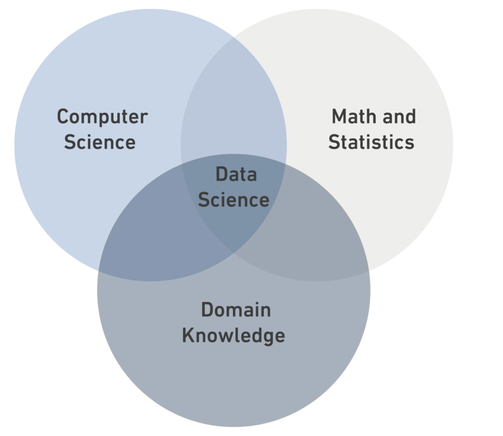

# Data Science

## What is Data Science?

**Data Science** is a *multidisciplinary field* that combines statistics, computer science, and domain knowledge.





### Data Types

- Structured Data
- Semi-Structured Data
- Unstructured Data

|                   | Structured                             | Semi-Structured                               | Unstructured              |
|-------------------|----------------------------------------|-----------------------------------------------|---------------------------|
| Description       | It is data that has been organized into a strict schema. | It is data that does not conform to a schema but has some structure. | It is data that has no schema. |
| Example           | e.g: tables                            | e.g: xml                                      | e.g: photos               |

For more information, you can visit [this link](https://en.wikipedia.org/wiki/Data_science).

```python
print("DS Bootcamp")
